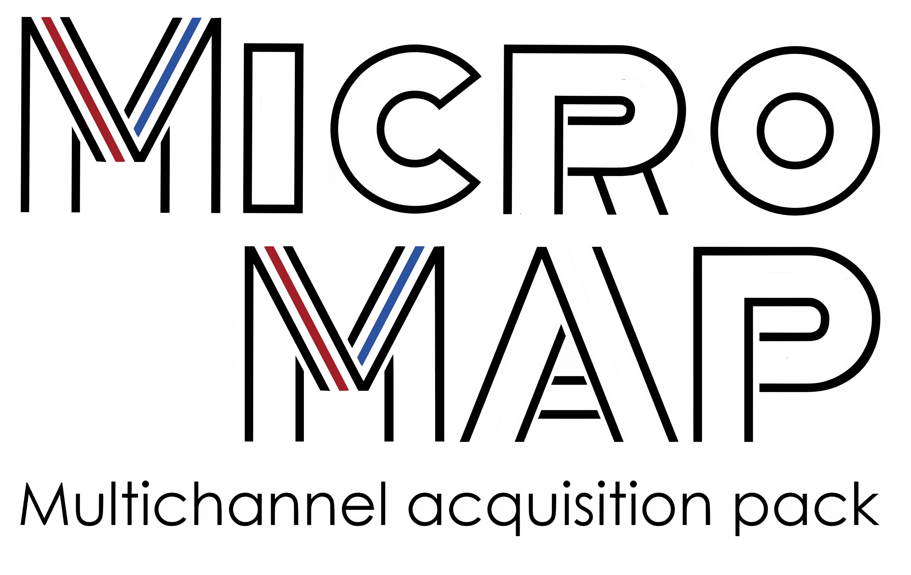

MicroMAP
========

   
|

####################
Welcome to MicroMAP
####################

MicroMAP is a low-cost, multi-channel electrophysiology acquisition system. This documentation provides instructions for installing the necessary software, setting up the hardware, and building the components.

All codes, 3D models, and PCB designs are available at the project's GitHub repository: https://github.com/nnc-ufmg/micromap.

.. toctree::
   :maxdepth: 2
   :caption: Contents:

   installation_python
   installation_arduino
   building_micromap
   building_headstage
   modules/interface_functions
   modules/user_interface
