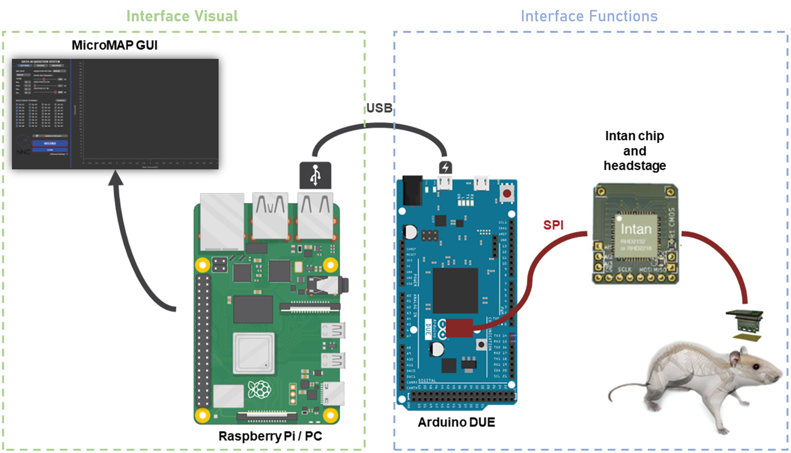

Micromap API
=========================

.. centered:: **MicroMAP** is separated into two main parts: 

   
|

**Interface Functions**
------------------------
.. toctree::
    :hidden:
    :caption: API

    /modules/interface_functions.rst

The main module that contains all the functions and classes that are used to create and manipulate the signal's
aquisition and preprocessing such as bandpass filters.

    This includes:
      - Acquisition class
      - USB handling class

**Interface Visual**
---------------------

The module that contains all the functions and classes that are used to create and manipulate the map's visual.

  This includes:
    - Plotting class
    - Data receiver class
    - Interface constructors

.. note::

  At this time, most of the functions listed in this section are used within the program and are not intended to be changed at the command line.
  However, the documentation of these functions is provided as reference for developers and for those who wish to understand how the data is 
  being processed.

.. toctree::
    :hidden:
    :caption: API

    /modules/interface_visual.rst

.. centered:: API Overview

.. toctree::

    /modules/interface_visual.rst
    /modules/interface_functions.rst